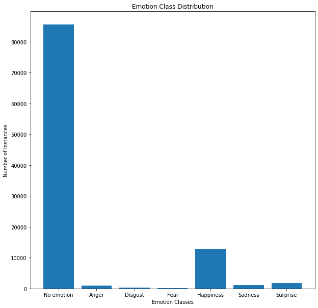
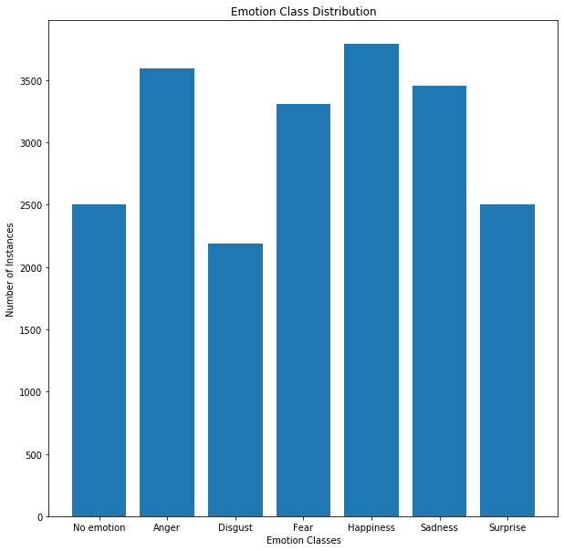
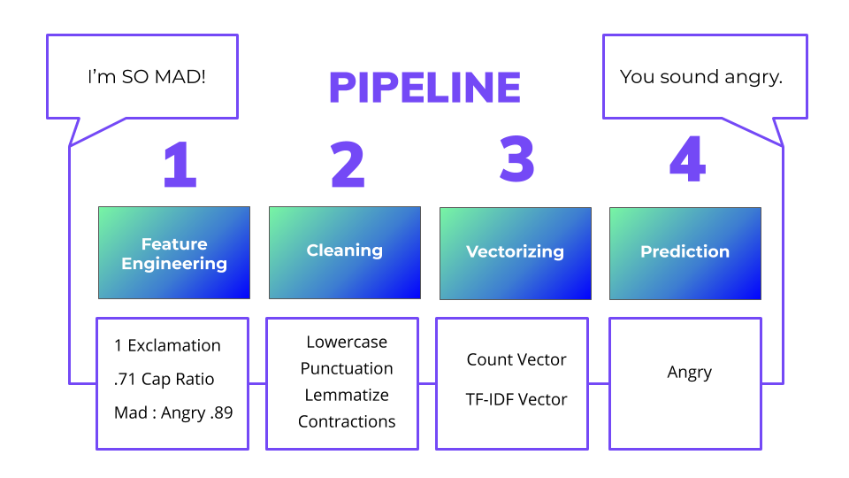
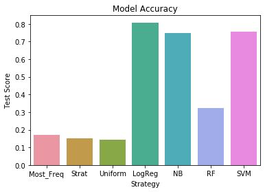
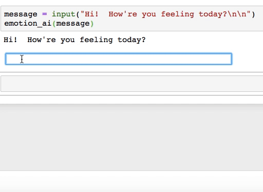
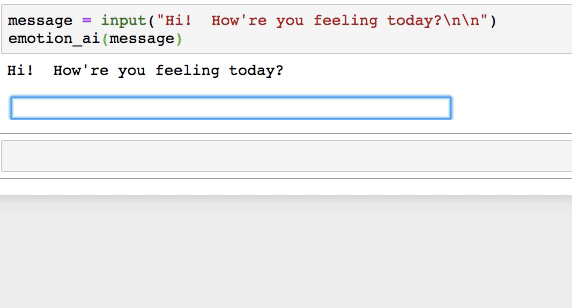

# emotionalAI
Natural Language Understanding for Emotion Classification

# Project
The goal of this project is to develop a Natural Language Understanding (NLU) algorithm for classifying the underlying emotion associated with a chat message so that chatbots and other programs can use this information to deliver a better experience to users.

# Background
People have goals that are explicit and implicit. Explicit goals are usually easy to identify because a person can clearly articulate them, like buying groceries or resolving a billing issue. Implicit goals, on the other hand, are more difficult to identify. These are emotional goals that aren't always articulated even though they are often more valuable than explicit goals. Not only does a person want to buy groceries, they also want to feel good about the experience.  If they don't, then they may never return to that grocery store again.

It requires emotional intelligence to accurately recognize emotions. As we all know from customer service interactions, not everyone has this level of emotional intelligence. If a program can automate this emotional classification process, then organizations could use this information to dramatically improve a wide variety of service encounters across industries.

# Use Case
The specific application of this classification algorithm will be for the NLU pipeline of an emotionally intelligent chatbot.  A demo of the chatbot is coming soon.

# Datasets
My primary dataset is the [DailyDialogue](http://yanran.li/dailydialog) dataset compiled for the International Joint Conference on Natural Language Processing (IJCNLP) in Taipei, Taiwan by Yanran Li, Hui Su, and Xiaoyu Shen, Wenjie Li, Ziqiang Cao, and Shuzi Niu.

This is a very thorough dataset that includes over 13,000 conversations and over 100,000 utterances.  Each conversation has been manually categroized by a topic while each utterance is additionally categorized with an emotion and a statement type.  For the purposes of this model, which I intend to put into the NLU pipeline of a chatbot, I'm only interested in the emotion classification because I won't be asking users to classify their own messages with a topic and an utterance type (although that would be an interesting classification project for the future).  However, I will include the topics and types below so you can see the diversity of utterances provided.
* ***Dialogue: string.  One utterance per row.***
* ***Emotion: int. The emotion associated with the text.***
    * 0: No emotion
    * 1: Anger
    * 2: Disgust
    * 3: Fear
    * 4: Happiness
    * 5: Sadness
    * 6: Surprise
* ***Type: int. The type of utterance.***
    * 1: Inform
    * 2: Question
    * 3: Directive
    * 4: Commissive
* ***Topic: The general topic of the conversation.***
    * 1: Ordinary Life
    * 2: School Life
    * 3: Culture & Education
    * 4: Attitude & Emotion
    * 5: Relationship
    * 6: Tourism
    * 7: Health
    * 8: Work
    * 9: Politics
    * 10: Finance

Although DailyDialog is thorough, it unfortunately has a significant class imbalance between the "no emotion" class and the other emotion classes.  

To address this imbalance, I decided to source additional data that I could use to supplement DailyDialog: a set compiled from the [PushShift API](https://github.com/pushshift/api) for Reddit and an additional Happy Path dataset that I personally developed with the specific use case of an emotional chatbot in mind.  The finalized dataset combines a random sampling of the DailyDialog and the Reddit comments with the Happy Path sentence templates containing emotion keywords.  The result is a smaller dataset with a little over 21,000 instances, but they are quality examples of emotion expression.

I wanted to make sure this updated dataset included simple utterances with emotion keywords (Happy Path), simple utterances without obvious emotion keywords (DailyDialog) as well as long, and often rambling, vents about a person's feelings (Reddit).  My hope is that training the classification model on these different types of utterances woudld make it less likely to output a false prediction.  

# Feature Engineering

Feature engineering is still a work in progress.  I completed a punctuation calculator, a capitalization ratio, and an emotion score.  The feature with the most promise is the emotion score which currently relies on the [NRC Exmotion Lexicon](http://sentiment.nrc.ca/lexicons-for-research/).  This lexicon contains keywords associated with my emotion classes as well as an intensity score between 0 and 1.  For example, "outrage" has an anger intensity score of 0.98 while "grumpy" has an anger intensity score of 0.3.

The calculator efficiently calculates the emotion scores for each utterance and ranks the emotions from highest intensity to lowest.  The downside is the lexicon.  It isn't currently robust enough to effectively score sentences from DailyDialog or Reddit, which use a more common, everyday vocabulary.  To make this feature as powerful as it could be, I need to update the lexicon to include more words.  Other challenges are detailed in the feature engineering notebook.

# Pipeline

The pipeline follows the progression outlined above.  
* The user's raw message is automatically analyzed using several feature functions to determine the punctuation calculation, the capitalization ratio and the emotion score.  
* Then the utterance is automatically converted to lowercase, punctuation is removed, words are lemmatized to their root words, and contractions are expanded. This pre-processing will make it easier to tokenize and vectorize the utterance.  
* The count vector determines the number of each word in the utterance out of all the words the words in the training corpus.  The TF-IDF vectorizer gives each word a score to determine how relevant it is based on its frequency across all utterances in the training set.  
* Then this vector is fed into the model with the additional features engineered and the prediction is output as well as dialogue based on the prediciton.

# Process & Repository Contents
* ***Sourcing & Cleaning:*** Sourcing & cleaning the datasets in preparation for modeling.
  * [emotion_ai_cleaning.ipynb](https://github.com/Frankafka/emotionalAI/blob/master/emotion_ai_cleaning.ipynb): cleaning the DailyDialog dataset.
  * [emotion_ai_pushshift_api_cleaning.ipynb](https://github.com/Frankafka/emotionalAI/blob/master/emotion_ai_pushshift_api_cleaning.ipynb): PushShift Reddit API & Happy Path Dataset.
* ***Baseline Modeling:**** Baseline modeling with several multi-class machine learning classification models to guide EDA and Feature Engineering.
  * [emotion_ai_baseline_modeling.ipynb](https://github.com/Frankafka/emotionalAI/blob/master/emotion_ai_eda.ipynb)
* ***Exploratory Data Analysis:*** Analysis of the dataset and visualizations to communicate insights. 
  * [emotion_ai_eda.ipynb](https://github.com/Frankafka/emotionalAI/blob/master/emotion_ai_eda.ipynb)
* ***Feature Engineering:*** Engineering of specific features beyound text tokens to improve predictability.
  * [emotion_ai_feature_engineering.ipynb](https://github.com/Frankafka/emotionalAI/blob/master/emotion_ai_feature_engineering.ipynb)
* ***Modeling & Evaluation:*** Modeling using the new features to examine their impact and identify the best model.
  * [emotion_ai_modeling_evaluation.ipynb](https://github.com/Frankafka/emotionalAI/blob/master/emotion_ai_modeling_evaluation.ipynb)
* ***Findings:*** 
  * [Emotional AI Presentation PDF](https://github.com/Frankafka/emotionalAI/blob/master/emotion_ai_deck.pdf)
  * Blog Post Coming Soon
  
# Findings

After addressing the class imbalance in the DailyDialog dataset and making a new, more accurate dataset that captures a wider range of emotion and provides a wider variety of utterance types, I was able to train several models and evaluate their effectiveness.  The best model was a logistic regression that achieved 80% accuracy with an F1-Score of 0.8.  I focused primarily on the F1-Score because the cost of a false negative and a false positive are essentially the same - both result in a false prediction for the user.  I also focused on accuracy because I want to see how effective overall the model is at outputting an accurate prediction while understanding that the accuracy of predictions vary by emotion class.

As you can see below, there is a marked improvement from the stratified dummy classifer which is essentialy the expected success rate of guessing the classification.

The goal here is to build a model that's good enough to put into production for a beta phase where I can test the model within a chatbot framework and gather more user data to train new models.

The model does well as classifying utterances containing emotion keywords like "down" for sad.  

The model also does relatively well on short utterances that don't contain keywords.

The model fails when handling large utterances that contain complex sentence structure and mention of several different emotions.  My hope is that the emotion score feature could help to improve the model's effectiveness in this regard.

# Next Steps

* Improve the emotion score calculator by updating the NRC emotion lexicon to include a wider variety of vocabulary.
* Train the data on a neural network to see if this improves the F1-score and accuracy.
* Input the trained model into a chatbot framework, like Rasa, and integrate the bot into a messaging service that would be easy to access, like Slack or Telegram.
* Set up a database to collect new inputs with their classifications and validations.
* Launch a beta phase to friends and family to gather as much new user data as possible and gain a more precise understanding of the model's weaknesses and strengths.
* Address weaknesses with new features and better models.

# Upcoming Projects

I want to continue down this path to develop a machine learning model that can effectively paraphrase a person's explanation of the causes and consequences of their emotions, which will enhance conversation with users and provide a way of gathering more contextual data to train more sophisticated emotion classifiers.
